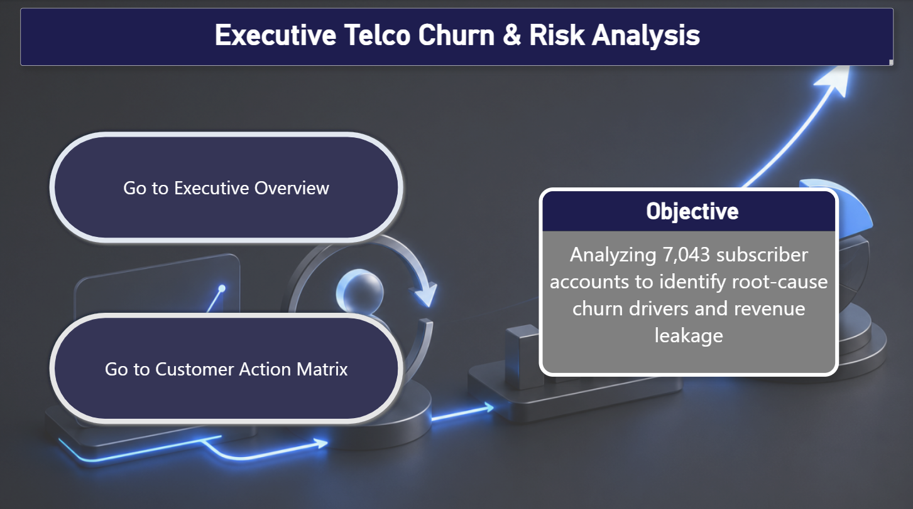
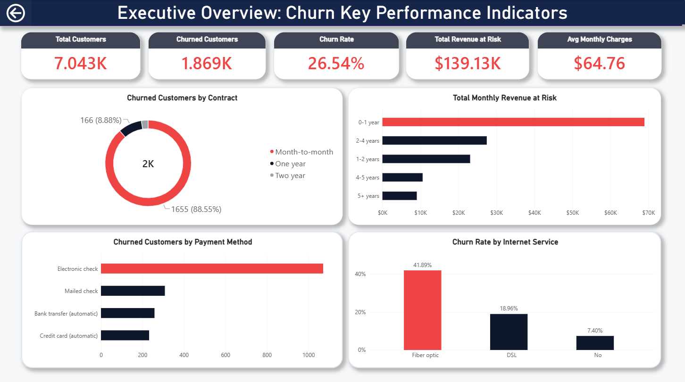
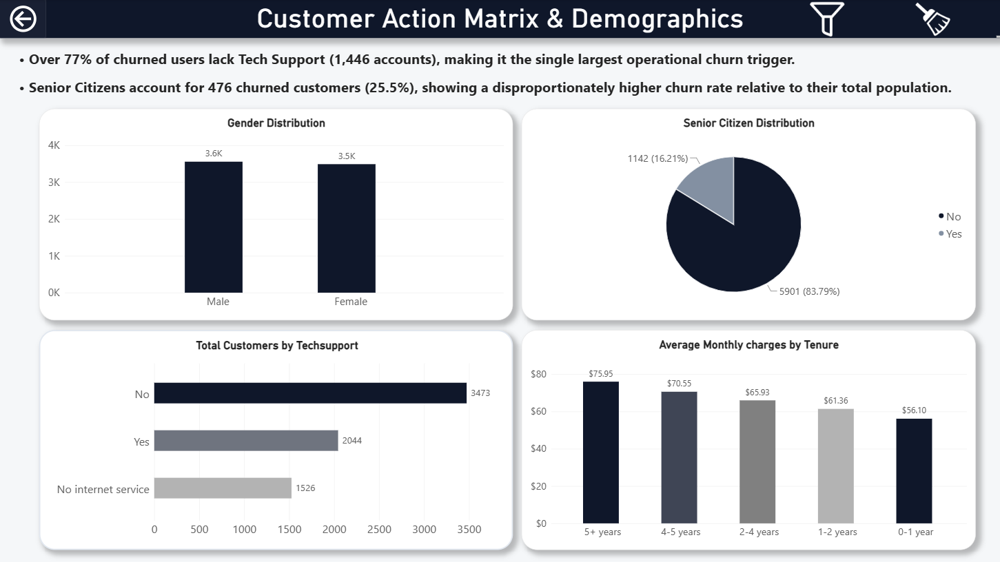

# Executive Telco Churn & Risk Analysis

An end-to-end data analytics project examining 7,043 subscriber accounts from the IBM Telco Churn dataset to uncover root causes of customer attrition and quantify revenue risk.

---

## 📌 Executive Summary
* Total Churn Rate: 26.54% (1,869 churned customers out of 7,043).
* Monthly Revenue at Risk: $139.13K lost monthly due to account cancellations.
* Primary Drivers: Month-to-month contracts (88.5% of churners) and lack of Tech Support (77.4% of churners).

---

## Dashboard Preview

### 1. Cover & Project Objective


### 2. Executive Overview (KPIs & Risk Distribution)


### 3. Customer Action Matrix & Demographics


---

## Key Business Insights

1. Tech Support is the #1 Retention Lever: Over 77% of churned users (1,446 accounts) lacked Tech Support. Enrolling high-risk users into support tiers significantly reduces churn risk.
2. Contract Type Vulnerability: Month-to-month subscribers account for $139K in lost MRR. Incentivizing 1-year or 2-year contract migrations is the most immediate churn mitigation strategy.
3. Senior Citizen Propensity: While forming 16.2% of total subscribers, Senior Citizens account for 25.5% of total churners, demonstrating disproportionately high churn risk.
4. Price Sensitivity at High Tenure: Loyal customers (5+ years) who churned paid significantly higher monthly charges ($97.32/mo average), indicating price fatigue drives late-stage cancellation.

---

## Project Structure

```text
Telco_Churn_Analysis/
├── dashboard/               # Power BI report (.pbix) & screenshots
│   ├── cover_page.png
│   ├── customer_action_matrix.png
│   ├── executive_overview.png
│   └── Telco_churn_analysis.pbix
├── data/                    # Dataset storage
│   ├── processed/
│   └── raw/
├── sql/                     # Analytical SQL scripts
│   ├── 01_schema_ddl.sql
│   ├── 02_data_ingestion.sql
│   └── 03_analytical_queries.sql
├── src/                     # Python ETL code
│   └── data_pipeline.py
├── .gitignore               # Git exclusions
├── requirements.txt         # Dependencies
└── README.md                # Project documentation
